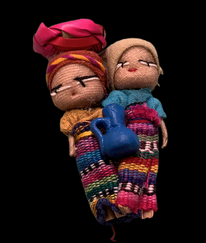

# **Quimera**

## _Game Design Document_

---

##### **Copyright notice / author information / boring legal stuff nobody likes**

- Alejandro Fernández del Valle Herrera **A01024998**

- Oswaldo Ilhuicatzi Mendizábal **A01781988**

- Andrea Alexandra Barrón Córdova **A01783126**

- Alan Anthony Hernández Pérez **A01783347**

- Mario Ignacio Frías Pina **A01782559**

##
## _Index_

---

- [**Quimera**](#quimera)
  - [_Game Design Document_](#game-design-document)
        - [**Copyright notice / author information / boring legal stuff nobody likes**](#copyright-notice--author-information--boring-legal-stuff-nobody-likes)
  - 
  - [_Index_](#index)
  - [_Game Design_](#game-design)
    - [**Summary**](#summary)
    - [**Gameplay**](#gameplay)
    - [**Mindset**](#mindset)
  - [_Technical_](#technical)
    - [**Screens**](#screens)
    - [**Controls**](#controls)
    - [**Mechanics**](#mechanics)
      - [Mecánicas activas](#mecánicas-activas)
        - [Movement](#movement)
          - [Side to side movement](#side-to-side-movement)
          - [Air movement](#air-movement)
          - [Jumps](#jumps)
          - [Dodge](#dodge)
        - [Combat](#combat)
          - [Short distance attack](#short-distance-attack)
          - [Mid distance attack](#mid-distance-attack)
          - [Long distance attack.](#long-distance-attack)
        - [Defense Mechanics](#defense-mechanics)
          - [Cloth doll (shield)](#cloth-doll-shield)
          - [Dodge](#dodge-1)
        - [Mecánicas de buffs](#mecánicas-de-buffs)
          - [Candy (temporary buffs)](#candy-temporary-buffs)
          - [Food (health regen)](#food-health-regen)
          - [Muñecas quitapenas (permanent buffs)](#muñecas-quitapenas-permanent-buffs)
        - [Mecánicas de inventario y contadores](#mecánicas-de-inventario-y-contadores)
          - [Cambio de armas](#cambio-de-armas)
          - [Life meter](#life-meter)
          - [Coin system](#coin-system)
          - [Doll counter](#doll-counter)
          - [Mecánicas de comercio](#mecánicas-de-comercio)
        - [Item shop](#item-shop)
          - [Items the shopkeeper can give](#items-the-shopkeeper-can-give)
      - [Mecánicas pasivas](#mecánicas-pasivas)
        - [Item drops](#item-drops)
          - [Bicitaxi (save / fast travel)](#bicitaxi-save--fast-travel)
          - [NPC](#npc)
      - [Cam movement](#cam-movement)
      - [Enemies](#enemies)
        - [Beginners](#beginners)
        - [Mid tier](#mid-tier)
          - [Bosses](#bosses)
      - [Environment](#environment)
        - [Traps](#traps)
        - [Pressure plates](#pressure-plates)
  - [_Level Design_](#level-design)
    - [**Themes**](#themes)
    - [**Game Flow**](#game-flow)
  - [_Development_](#development)
    - [**Abstract Classes / Components**](#abstract-classes--components)
    - [**Derived Classes / Component Compositions**](#derived-classes--component-compositions)
  - [_Graphics_](#graphics)
    - [**Style Attributes**](#style-attributes)
    - [**Graphics Needed**](#graphics-needed)
  - [_Sounds/Music_](#soundsmusic)
    - [**Style Attributes**](#style-attributes-1)
    - [**Sounds Needed**](#sounds-needed)
    - [**Music Needed**](#music-needed)
  - [_Schedule_](#schedule)

## _Game Design_

---

### **Summary**

Quimera is a metroidvania-rpg where you play as Alex looking for their mom in a rapid-fire  adventure inside a fantastic mexican folklore dream. You will have to make friends and defeat enemies to survive, but be carefull, people are not always what they seem. 

### **Gameplay**

The gameplay is a side-scrolling action adventure game with RPG elements, where you have to move and fight in a 2D world using different types of weapons and items with a Mexican cultural theme.

The goal of the game is to progress through the different levels and find out the truth about the dreams that Alex has been having. In each of these levels there are both platforming and combat challenges, where there are some normal enemies throughout the level and a final boss at the end.

In terms of tactics the player should be resourceful and know how to use the tools and weapons provided, at what time and in what way, depending the situation.

### **Mindset**

The player should feel the fear that Alex feels at the beginning of the adventure, and as the game progresses both Alex and the player get stronger. At the same time the player should want to adventure through the world and see all the things that it contains, but without hurry. We want to provoke these emotions through the mechanics of movement and combat of our game.

It is important that the player feels constantly challenged, and that the game adapts its difficulty to maintain a challenging environment.

The play should be having a similar experience to what a child would feel when getting into a mystical world. having lots of awe at the beginning, but then realizing that “I’m in trouble”.

## _Technical_

---

### **Screens**

1. Title Screen
    1. Options
2. Level Select
3. Game
    1. Inventory
    2. Assessment / Next Level
4. End Credits

_(example)_

### **Controls**

How will the player interact with the game? Will they be able to choose the controls? What kind of in-game events are they going to be able to trigger, and how? (e.g. pressing buttons, opening doors, etc.)

### **Mechanics**

Our game has various mechanics that you will need for the player to have a better experience. In this section, we will define active mechanics (that is, what the user will be able to do directly) as well as passive mechanics (elements of the game where the player does not have to do anything). 

#### Mecánicas activas

##### Movement

###### Side to side movement

The player will be able to move left and right with the keys "a" and "d" respectively. To be able to move more realistically, the player will be able to use a movement considering momentum, that is, it will take a while to stop, and the faster the player goes, the longer it will take to stop.

###### Air movement

While the player is in the air, he will have a more limited movement, that is, he will be able to make small corrections, but the movement will not be as fluid as when he is touching the ground. 

While you are in the air you will not be able to recharge your movements. That is, if you jump and then hit, you will not be able to hit again until you touch the floor again.

###### Jumps 
The player will have a simple jump. It will be able to jump every time it touches the ground, and it will only be regained by touching the ground once again. 

His jump may be considered "high" because it will help the player to be able to climb the height with which the game is planned. 

Thanks to the limited air mobility, the player will have to be very careful when jumping. To jump the player will have to press "Space". 

The jump will use a graph to be able to jump high, or you can make a short jump by releasing the space bar early, cutting its momentum and increasing its level of relative gravity.

###### Dodge

To help the player navigate, and provide him with an advantage if he knows the mechanics of the game well, the player will get a doge action. This action will throw the player slightly backwards and upwards in the opposite direction to the one they are walking towards. This action can also allow the player to give the player speed needed to evade an attacking enemy. 

To doge, the player can use “CTRL”

Close range attack

If the player tries to attack close range, the player can use a wooden snake as a whip. The statistics that will be considered when the player hits an enemy are as follows: 

- knockback
- velocity 
- damage 
- Recharge time 
- Range distance 

This weapon will be able to make area attack. To activate it, "Right click"

##### Combat

###### Short distance attack

If the player tries to attack close range, the player can use a wooden snake as a whip. The statistics that will be considered when the player hits an enemy are as follows: 

1. knockback
1. velocity 
1. damage 
1. Recharge time 
1. Range distance 

This weapon will be able to make area attack. To activate it, "Right click"

###### Mid distance attack

To attack at medium distance, the user will be able to use a “trompo” to hit someone. The “trompo” is going to be thrown as an object (but it will stay attached to the player), and it will have a limit of enemies that it will be able to hit. It will be very similar to the way you would throw a chain in other games. The statistics you will use are as follows: 

1. knockback 
1. velocity
1. weight 
1. damage 
1. Recharge time 
1. Range distance 
1. max enemies attacked 

Once thrown, the “trompo” will return to the player to allow him to throw it again. To activate it, "Left click"

###### Long distance attack. 

So that the player can defend himself from a distance, he will be granted a top that will serve as a projectile. The top is going to stay rolling, and it will damage the enemies as long as it has speed to roll. The top is going to be thrown, and it will function as an independent object. The only way to get it back is to grab it again by getting closer to it. The statistics you will use are as follows: 

1. knockback 
1. Personal knockback 
1. velocity 
1. weight 
1. damage 
1. Recharge time 
1. Range distance 
1. max enemies attacked 
1. Speed when throwing 

To activate it, "central mouse"

##### Defense Mechanics

###### Cloth doll (shield)

The cloth doll is a typical doll that will fill the role of protecting you during your dreams. It can be used at any moment, and it will completely nullify any damage, but it will break in the process. This means that the doll will be a one use item, protecting the player from any attack, but they have to be careful when they use it, because they will have a max capacity of 5. They also don’t come cheap, either by being rare items on the field, or by being expensive. 

The key to activate is “Z” (hold)

###### Dodge

The doge is described above, but it will be useful when trying to avoid enemies, reducing the damage taken.

##### Mecánicas de buffs

###### Candy (temporary buffs)

Enemies will drop random loot such as candy and coins. This candy will give a temporary buff to the player. The buff will be applied based on the type of candy, adding a temporary damage multiplier tol be the following types:

- Speed
- Attack
- Damage

This will make swarms less difficult to clear, and rewarding aggressive gameplay.

This will also make players feel more “In the zone”, clearing hoards, and making the player feel a rush when they do.

###### Food (health regen)

The only way you will be able to regain health is through consuming food items. The food can be bought at the ropaviajeros, and will allow you to buy a max of 10 items. After buying food, the player will be able to eat one of the food items, gaining 20 HP per food item (2 full heals). 

The player can consume one food item by pressing “E”

###### Muñecas quitapenas (permanent buffs)

Once you get a doll, it gets added as skill points. When pressing “I”, you open an inventory that allows you to click on what you want to upgrade. Once upgraded, there is no going back.

##### Mecánicas de inventario y contadores

###### Cambio de armas

When making a weapon better, you can choose to affect one of the weapons to make it better. Depending on what gets chosen, the color of the weapon will change (based on an rgb value or something like that)

###### Life meter

The player will always have its life meter visible. This will display the percentage of life remaining (from 0 to 100). This will not change. To make the character feel like he has progressed, armor stats will increase.

###### Coin system

We will use chocolate coins as the currency to buy items. When an enemy gets defeated, a counter will go up, and the animation of the player will show the coins going into the player.

###### Doll counter

There will be a counter for cloth dolls. Cloth dolls get used only when being activated while using shields. This will get displayed as a counter.

###### Mecánicas de comercio

Once you find a “Ropaviajeros”, known because the cri cri song plays. You can exchange the in-game currency to get certain items. Items will be picked at random, and will only refresh once the ropaviajeros decides to move location. The ropaviajero changes location at random on certain chosen points, ans will not appear for a certain amount of time. THe point of the ropaviajeros is that once you find him, it will be at random how long he stays, I mean, he is not part of your life, he needs to get going to pay the bills.

##### Item shop

When interacting with the ropaviajeros, a UI will open. This will let you choose between different items. You can buy them there, or leave it. Once you buy it, it gets added to your inventory.

###### Items the shopkeeper can give

- Life
- Dolls
- Weapon upgrades

#### Mecánicas pasivas

##### Item drops

Item drops will use an SQL table, where we can give a random amount of drops based on how the player interacts. This means that, any monster will get a category, and it will drop a random amount of items based on the progression and a loot table.

The player will then be able to get any amount.

###### Bicitaxi (save / fast travel)

The Bicitaxi will be the only place where you can save the game. After saving, you can use it for fast travel. Any unlocked bicitaxi will allow you to go to it. They will be placed along the map at specific locations.

###### NPC 

NPC’s will be used only as worldbuilding, making the world more alive on the overworld. 

They will take lines from a db, and it will loop through the chat options. To make the characters also helpful, we will try to use 

#### Cam movement

To move the camera, we will use cinemachine. This will let you Look forward when running around, allowing the player to see what will come next. The camera will also have a smooth dampening to help users with diverse eye problems feel more comfortable.

#### Enemies

There will be 3 types of enemies:

- The beginners
- The medium
- The boss

##### Beginners

This enemies are easy to kill. Their AI will be focused on just walking to the player, and the main objective is to give the player a challenge based on swarms.

##### Mid tier

These enemies will have the ability to try to get close and make better combat. The enemies that are considered mid tier will have better base stats, and will be considered as a challenge by just themselves.

###### Bosses

Each boss will have their own mechanics. THe mechanics are described on how the boss will move.

#### Environment

The environment will have various traps and tricks that you will be able to overcome.

##### Traps

In some places, there will be places where you can fall through the ground. The ground will be a slightly different color, but other than that, it will be almost the same.

##### Pressure plates

Some places will be achievable by using pressure plates. You can activate them by using enemies, yourself, or your toys.

Pressure plates will have the ability to move objects in game, spawn new object or set actions.

## _Level Design_

---

_(Note : These sections can safely be skipped if they&#39;re not relevant, or you&#39;d rather go about it another way. For most games, at least one of them should be useful. But I&#39;ll understand if you don&#39;t want to use them. It&#39;ll only hurt my feelings a little bit.)_

### **Themes**

1. Forest
    1. Mood
        1. Dark, calm, foreboding
  2. Objects
        1. _Ambient_
            1. Fireflies
            2. Beams of moonlight
            3. Tall grass
        2. _Interactive_
            1. Wolves
            2. Goblins
            3. Rocks
2. Castle
    1. Mood
        1. Dangerous, tense, active
    2. Objects
        1. _Ambient_
            1. Rodents
            2. Torches
            3. Suits of armor
        2. _Interactive_
            1. Guards
            2. Giant rats
            3. Chests

_(example)_

### **Game Flow**

1. Player starts in forest
2. Pond to the left, must move right
3. To the right is a hill, player jumps to traverse it (&quot;jump&quot; taught)
4. Player encounters castle - door&#39;s shut and locked
5. There&#39;s a window within jump height, and a rock on the ground
6. Player picks up rock and throws at glass (&quot;throw&quot; taught)
7. … etc.

_(example)_

## _Development_

---

### **Abstract Classes / Components**

1. BasePhysics
    1. BasePlayer
    2. BaseEnemy
    3. BaseObject
2. BaseObstacle
3. BaseInteractable

_(example)_

### **Derived Classes / Component Compositions**

1. BasePlayer
    1. PlayerMain
    2. PlayerUnlockable
2. BaseEnemy
    1. EnemyWolf
    2. EnemyGoblin
    3. EnemyGuard (may drop key)
    4. EnemyGiantRat
    5. EnemyPrisoner
3. BaseObject
    1. ObjectRock (pick-up-able, throwable)
    2. ObjectChest (pick-up-able, throwable, spits gold coins with key)
    3. ObjectGoldCoin (cha-ching!)
    4. ObjectKey (pick-up-able, throwable)
4. BaseObstacle
    1. ObstacleWindow (destroyed with rock)
    2. ObstacleWall
    3. ObstacleGate (watches to see if certain buttons are pressed)
5. BaseInteractable
    1. InteractableButton

_(example)_

## _Graphics_

---

### **Style Attributes**

What kinds of colors will you be using? Do you have a limited palette to work with? A post-processed HSV map/image? Consistency is key for immersion.

What kind of graphic style are you going for? Cartoony? Pixel-y? Cute? How, specifically? Solid, thick outlines with flat hues? Non-black outlines with limited tints/shades? Emphasize smooth curvatures over sharp angles? Describe a set of general rules depicting your style here.

Well-designed feedback, both good (e.g. leveling up) and bad (e.g. being hit), are great for teaching the player how to play through trial and error, instead of scripting a lengthy tutorial. What kind of visual feedback are you going to use to let the player know they&#39;re interacting with something? That they \*can\* interact with something?

### **Graphics Needed**

1. Characters
    1. Human-like
        1. Goblin (idle, walking, throwing)
        2. Guard (idle, walking, stabbing)
        3. Prisoner (walking, running)
    2. Other
        1. Wolf (idle, walking, running)
        2. Giant Rat (idle, scurrying)
2. Blocks
    1. Dirt
    2. Dirt/Grass
    3. Stone Block
    4. Stone Bricks
    5. Tiled Floor
    6. Weathered Stone Block
    7. Weathered Stone Bricks
3. Ambient
    1. Tall Grass
    2. Rodent (idle, scurrying)
    3. Torch
    4. Armored Suit
    5. Chains (matching Weathered Stone Bricks)
    6. Blood stains (matching Weathered Stone Bricks)
4. Other
    1. Chest
    2. Door (matching Stone Bricks)
    3. Gate
    4. Button (matching Weathered Stone Bricks)

_(example)_

## _Sounds/Music_

---

### **Style Attributes**

Again, consistency is key. Define that consistency here. What kind of instruments do you want to use in your music? Any particular tempo, key? Influences, genre? Mood?

Stylistically, what kind of sound effects are you looking for? Do you want to exaggerate actions with lengthy, cartoony sounds (e.g. mario&#39;s jump), or use just enough to let the player know something happened (e.g. mega man&#39;s landing)? Going for realism? You can use the music style as a bit of a reference too.

 Remember, auditory feedback should stand out from the music and other sound effects so the player hears it well. Volume, panning, and frequency/pitch are all important aspects to consider in both music _and_ sounds - so plan accordingly!

### **Sounds Needed**

1. Effects
    1. Soft Footsteps (dirt floor)
    2. Sharper Footsteps (stone floor)
    3. Soft Landing (low vertical velocity)
    4. Hard Landing (high vertical velocity)
    5. Glass Breaking
    6. Chest Opening
    7. Door Opening
2. Feedback
    1. Relieved &quot;Ahhhh!&quot; (health)
    2. Shocked &quot;Ooomph!&quot; (attacked)
    3. Happy chime (extra life)
    4. Sad chime (died)

_(example)_

### **Music Needed**

1. Slow-paced, nerve-racking &quot;forest&quot; track
2. Exciting &quot;castle&quot; track
3. Creepy, slow &quot;dungeon&quot; track
4. Happy ending credits track
5. Rick Astley&#39;s hit #1 single &quot;Never Gonna Give You Up&quot;

_(example)_

## _Schedule_

---

_(define the main activities and the expected dates when they should be finished. This is only a reference, and can change as the project is developed)_

1. develop base classes
    1. base entity
        1. base player
        2. base enemy
        3. base block
  2. base app state
        1. game world
        2. menu world
2. develop player and basic block classes
    1. physics / collisions
3. find some smooth controls/physics
4. develop other derived classes
    1. blocks
        1. moving
        2. falling
        3. breaking
        4. cloud
    2. enemies
        1. soldier
        2. rat
        3. etc.
5. design levels
    1. introduce motion/jumping
    2. introduce throwing
    3. mind the pacing, let the player play between lessons
6. design sounds
7. design music

_(example)_